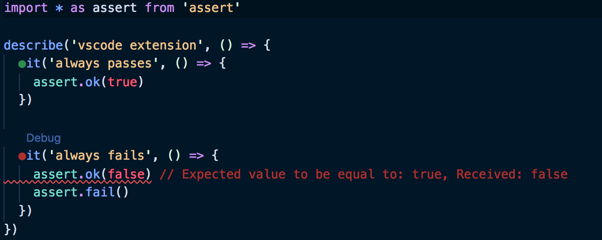

# jest

- [docs](https://jestjs.io/)

- dependencies: `npm i jest jest-cli`
- directory with tests can be _anything_
- npm script: `"test": "jest"`, fire
- watch mode: `npm test -- --watch`

## `vscode-jest extension`

- [extension](https://marketplace.visualstudio.com/items?itemName=Orta.vscode-jest)
- [example](spec/extension.spec.js), green and red dots near `it`s

## adding config

- either `jest --init` or `./node_modules/.bin/jest --init`

## adding babel

- `npm i babel-jest @babel/core @babel/preset-env`
- add `babel.config.js` file with [predefined content](https://github.com/facebook/jest#using-babel)

## typescript

- `npm i @types/jest`
- install TS typings for node.js built-in `assert` to benefit from static typing:
  - `npm i @types/node`
  - `import * as assert from 'assert'` (since babel is there for `import` anyway, otherwise `require`)

## `jest` walk-through

- `npm test`

(create a simple test file and copy the file few times, including subdirectories)
- or filtered by directory: `npm test src/lib/render-prop/`
- `c` - clear filters

- filtering from command line - interactive display of matching items (convenient!)
  - `t` - test name regexp
  - `p` - file path regexp

- `a` - run all tests
- `o` - only changed files

- `u` - update snapshots, e.g. remove after file is obsolete

- `f` - run only failed tests; then `f` again to quit

- `q` - quit watch mode

## mocking in jest

- `jest.fn`: Mock a function
- `jest.mock`: Mock a module
- `jest.spyOn`: Spy or mock a function

based on [this](https://medium.com/@rickhanlonii/understanding-jest-mocks-f0046c68e53c).

## examples

- [simple example](spec/calc.spec.js)
- [node.js assert module](spec/node-assert.spec.js)
- [`vscode-jest` extension](spec/extension.spec.js), green and red dots
- [mocking ES6 module (`jest.mock()`) and stubbing dependency implementation](spec/mock-stub)
- [spies](spec/spy.spec.js)
  - anonymous mock fn
  - mock fn
  - mock object method
  - return values
  - return async values (promise-based)
- [async tests (promise returned, async/await, `done`)](spec/async.spec.js)
- [custom matchers](spec/custom-matchers/custom-matchers.spec.js) + [definitions](spec/custom-matchers/jest-custom-matchers.js)
  - [docs](https://jestjs.io/docs/en/expect#custom-matchers-api)
- [`jest-in-case`](spec/jest-in-case.spec.js)
