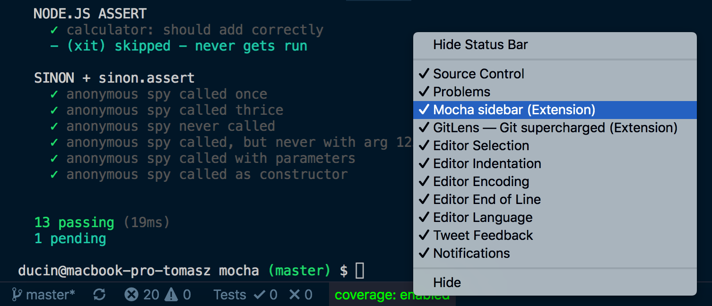

# mocha

- dependencies: `npm i mocha`, additional: `npm i chai sinon`
  - mocha is: `describe`, `it` and the test runner
  - sinon: stubs, spies, fakes, etc.
  - chai: assertions
- create directory with tests, e.g. `spec`
- npm script:
  - `"test": "mocha"` if dir == `test`
  - otherwise `mocha spec`
  - or with glob: `mocha spec/**` or `mocha spec --recursive`
  - watch mode: `mocha -w`

## specific

- `mocha test --reporter nyan`
- pattern matching:
  - `npm test -- --grep tick`, `npm test -- --grep @assert`
  - or inversted: `npm test -- --grep tick --invert`
- instead of `beforeAll`/`afterAll`, mocha supports `before`/`after`

## extension

- [ES6 mocha snippets](https://marketplace.visualstudio.com/items?itemName=spoonscen.es6-mocha-snippets)
  - `describeAndIt`

- [extension](https://marketplace.visualstudio.com/items?itemName=maty.vscode-mocha-sidebar)

  - requires `nyc` installed (`istanbul` CLI package)
  - requires folder to be called `test`, not `spec`
  - click the test-tube icon below extensions icon in vscode bar

## typescript

- `npm i @types/mocha`
- install TS typings for node.js built-in `assert` to benefit from static typing:
  - `npm i @types/node`
  - `const assert = require('assert')`

## async tests

- when `it('test', async(done) => {...})` - `Error: Resolution method is overspecified. Specify a callback *or* return a Promise; not both.`

## examples

- [node.js assert module + `xit`](spec/node-assert.spec.js)
- [chai assertions: `assert`, `should`, `expect`](spec/chai.spec.js)
- [custom assertions](spec/custom-assertions.spec.js)
- sinon
  - [sinon spies](spec/sinon/spies.spec.js)
  - [sinon/lolex - mocking timers](spec/timers/lolex.spec.js), `npm i lolex`
